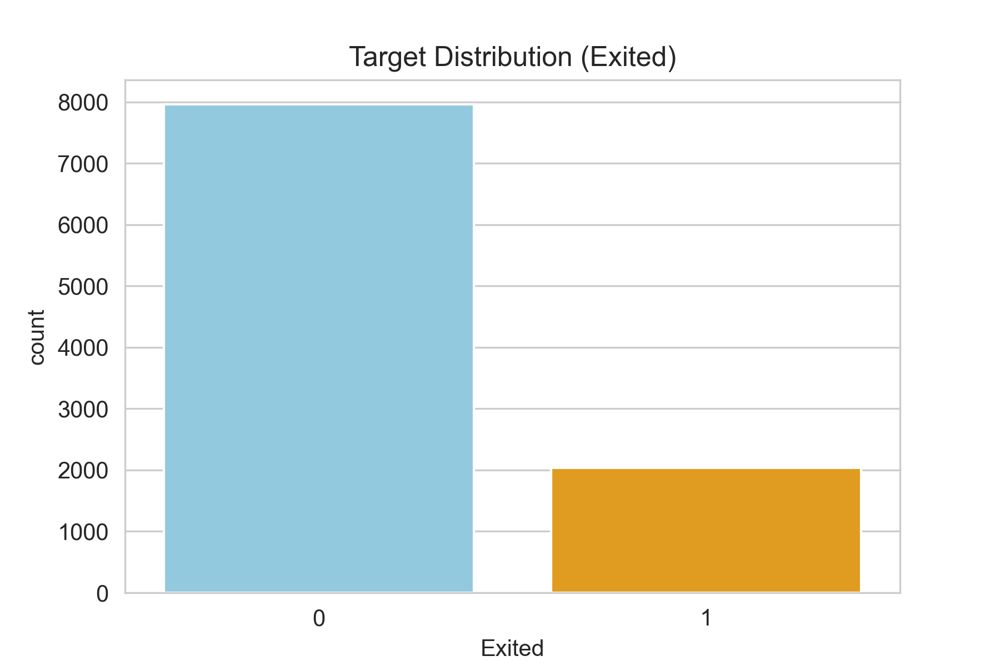
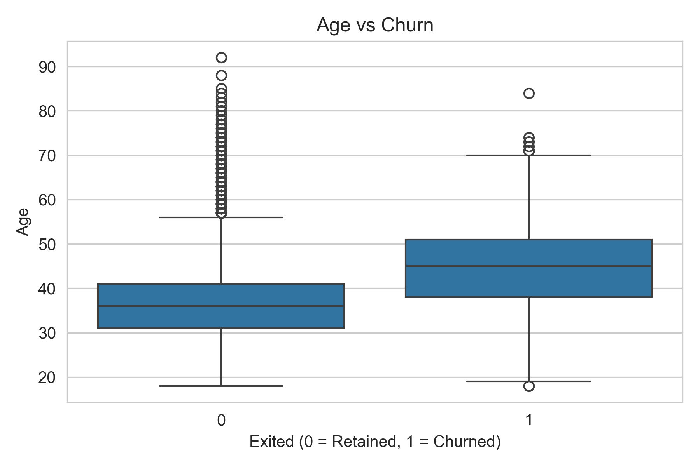
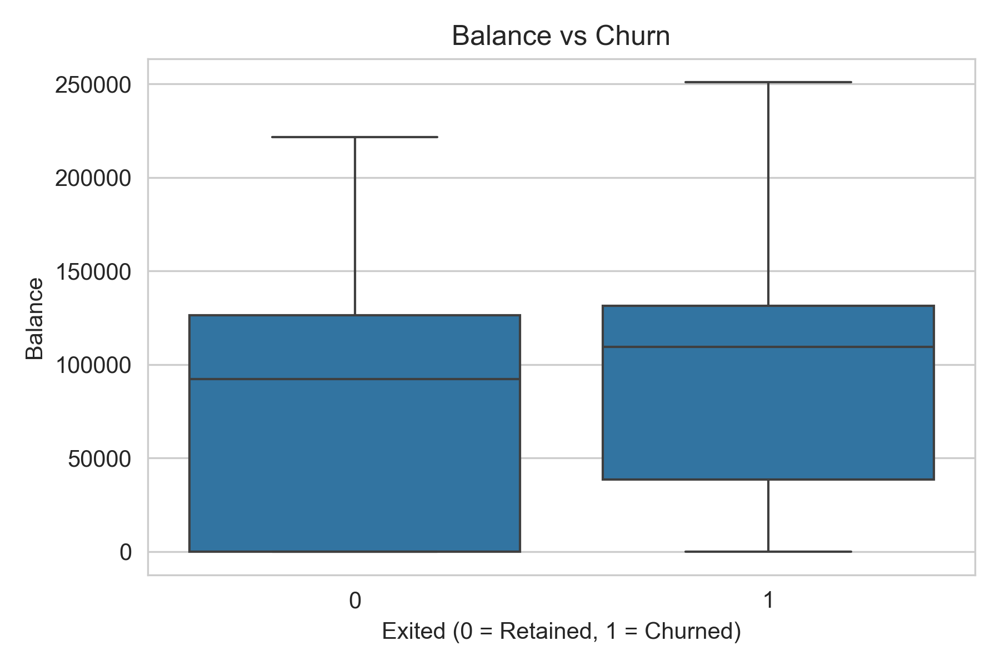
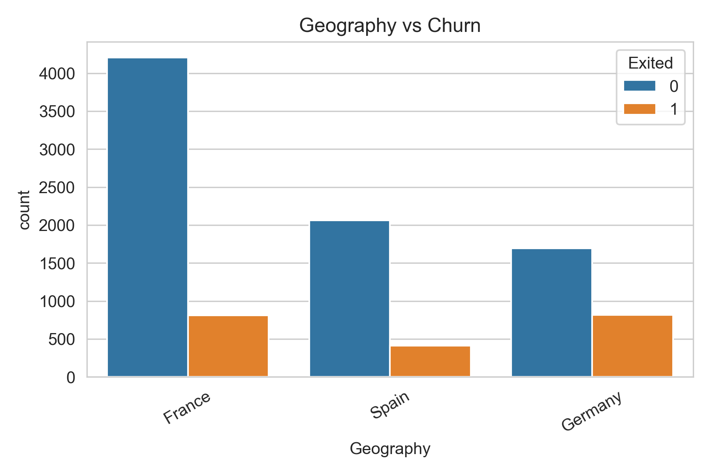
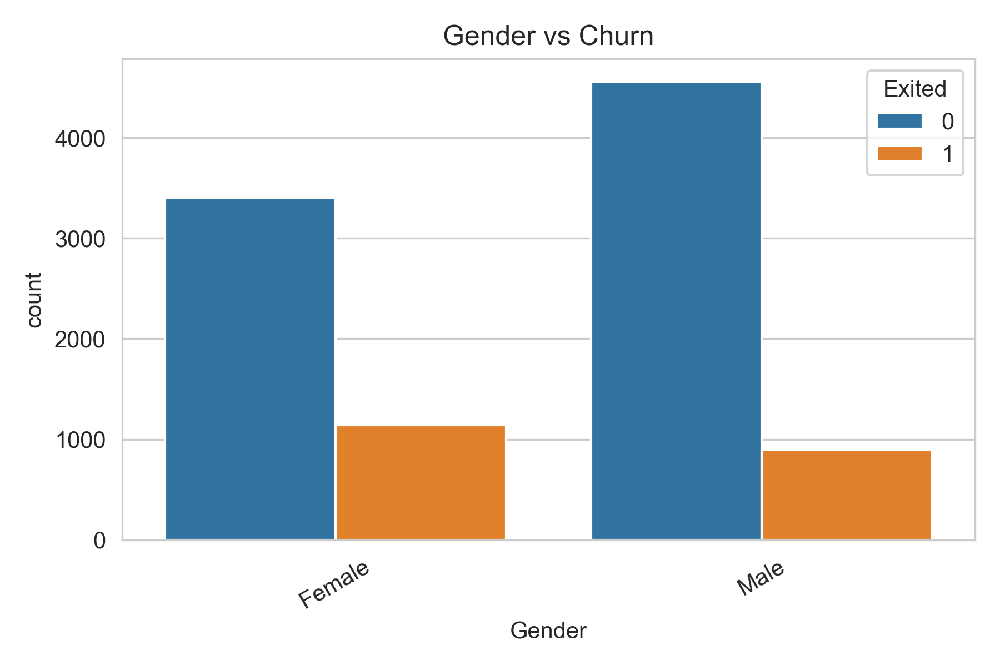
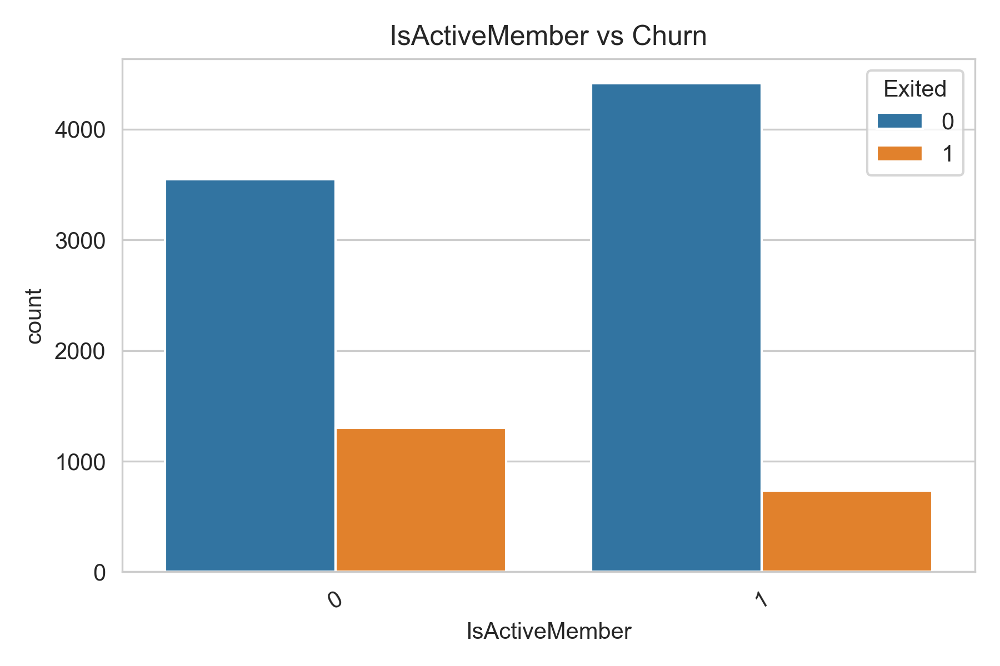
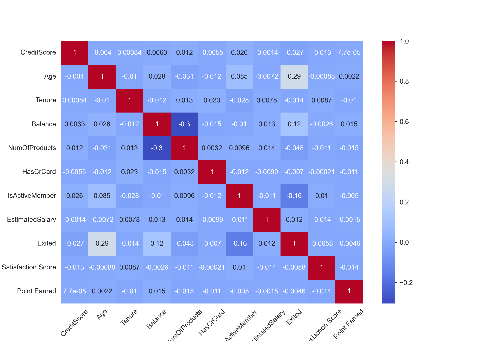

## Customer Churn Prediction

### Project Overview
Customer churn is a major challenge in the banking sector. This project builds a machine learning system to predict whether a customer will leave the bank based on demographic, behavioral, and account-related features.
The goal is to help businesses proactively identify high-risk customers and improve retention strategies.

### Dataset Overview

**Records**: ~10,000 customers

**Features**: 18 (demographics, account details, customer activity)

**Target Variable**: Exited

1 → Customer churned

0 → Customer retained

**Key Features**:
Age, CreditScore, Balance
NumOfProducts, IsActiveMember, EstimatedSalary
Geography, Gender, Tenure
HasCrCard, Complain

### **Libraries** **used**:
1. Python 
2. Pandas
3. NumPy
4. Scikit-learn
5. Matplotlib / Seaborn
6. Joblib

### **Exploratory Data Analysis (EDA)**

Performed exploratory analysis to understand customer behavior and identify churn patterns.

### Target Variable Distribution
Churn rate is approximately 20%, indicating an imbalanced dataset
Majority of customers (~80%) are retained

#### Insights
##### Age:
Customers aged 39–51 show a higher likelihood of churn. Younger and older customers tend to churn less, indicating a non-linear relationship between age and churn.
##### Tenure:
Customers with 2–8 years of tenure show slightly higher churn. However, the overall impact is moderate.
##### Balance:
Churned customers have a slightly higher median balance (~$110K) compared to retained customers (~$90K). This suggests a weak positive relationship between balance and churn.
##### Estimated Salary & Points Earned:
These features show little to no significant impact on churn.

#### Visualizations

Overall churn rate was ~20%, handled using stratified sampling and proper evaluation metrics like F1-Score, Recall instead of accuracy.

### Numerical Feature Analysis

#### Age vs Churn

Customers aged 39–51 and those with balance around $110k showed higher churn.

#### Balance

### Categorical / Binary Features
#### Geography vs Churn

#### Gender vs Churn

#### ActiveMember Vs Churn

#### Categorical Feature Insights

#### Geography: 
France (16%) & Germany (32%) churn more than Spain (17%)
#### Gender:
Females churn more (25%) than males (16%)
#### Card Type: 
Diamond holders churn highest (22%),Gold 19%, Platinum 20%, Silver 20%
#### Customer Behavior Insights
#### IsActiveMember:
Inactive customers are much more likely to churn, making this one of the strongest predictors.
#### NumOfProducts:
Customers with fewer products tend to churn more, but the effect is moderate.

**Correlation Heatmap**

* Age shows a positive correlation with churn
* IsActiveMember shows a strong negative correlation
* EstimatedSalary has very weak correlation
* Complain Feature:
Removed due to **perfect correlation with churn (data leakage)**

**Segmentation Analysis (EDA Only)**
Age-based segmentation shows highest churn in 45–54 age group (~50%)
Credit score and salary groups show minimal variation in churn

#### Note: 
These engineered features were used only for analysis and not included in the final model.

**Key Takeaways**
#### Key Takeaways
* Churn rate is 20% (imbalanced dataset)
* Middle-aged customers (39–54) are most likely to churn
* Germany has the highest churn rate
* Female customers churn more than males
* Inactive members are highly likely to churn
* Balance has a slight influence, while salary and credit score have minimal impact
* Data leakage feature (‘Complain’) was removed

#### Business Impact
These insights help businesses:
* Identify high-risk customers
* Focus on mid-age and inactive users
* Improve customer engagement strategies
* Design targeted retention campaigns

### **Data Preprocessing & Feature Engineering**

1. Removed irrelevant columns (RowNumber, CustomerId, Surname)

2. Applied one-hot encoding for categorical variables

3. Scaled numerical features using StandardScaler

4. Used stratified train-test split to handle class imbalance

5. No missing values were found, and duplicates were removed.

### Machine Learning Pipeline

The project uses an end-to-end ML pipeline to streamline data preprocessing, model training, and evaluation. This ensures reproducibility and allows easy experimentation with multiple models.

**Pipeline Steps**:

Data Loading

Data Cleaning

Feature Encoding & One-Hot Encoding for categorical variables

Train-Test Split (Stratified)

Feature Scaling (StandardScaler)

Model Training

Model Evaluation (Accuracy, Precision, Recall, F1-score)

Model Saving

Model Deployment (Flask API for real-time predictions)

Using a pipeline helps maintain consistency across all models and reduces manual preprocessing errors, making the workflow robust and scalable

### Model training

Trained and compared multiple machine learning models:
1. Random Forest
2. K-Nearest Neighbors (KNN)
3. Support Vector Machine (SVM)
4. Gradient Boosting Classifier

### Hyperparameter Tuning
- Initial models used manually selected hyperparameters.  
- For SVM:
  - `C = 0.5`, `kernel = 'rbf'`, `gamma = 'scale'`, `class_weight = 'balanced'`  
  - Chosen to balance recall and precision for churn prediction.  
- Future improvements include automated tuning using GridSearchCV or RandomizedSearchCV to optimize performance.

### Model Evaluation Results
After training multiple machine learning models for customer churn prediction, the following performance metrics were obtained:

### Evaluation Metrics
- **Accuracy:** Overall correctness of predictions.  
- **Precision:** Fraction of predicted churn customers who actually churned.  
- **Recall:** Fraction of actual churn customers correctly identified. *(Critical for business use-case)*  
- **F1-Score:** Harmonic mean of precision and recall, used to evaluate imbalanced datasets.

#### Random Forest
Accuracy: 0.87
Precision: 0.80
Recall: 0.49
F1 Score: 0.60
ROC AUC Score:0.72

#### Insight: 
High accuracy and precision, but fails to capture a large portion of churn customers (low recall).

#### K-Nearest Neighbors (KNN)
Accuracy: 0.81
Precision: 0.56
Recall: 0.36
F1 Score: 0.44
ROC AUC Score:0.64
 
#### Insight: Overall weaker performance compared to other models.

#### Support Vector Machine (SVM)
Accuracy: 0.78
Precision: 0.48
Recall: 0.75
F1 Score: 0.59
ROC AUC Score:0.77

#### Insight: 
This model captures 75% of churners, which is crucial for retention. ROC-AUC of 0.77 shows good separation between churn and non-churn customers.
#### Gradient Boosting
Accuracy: 0.86
Precision: 0.74
Recall: 0.50
F1 Score: 0.60
ROC AUC Score:0.72

#### Insight: 
Provides a good balance between precision and recall.

##### Best Model Selection

The Support Vector Machine (SVM) was chosen as the best model because it has the highest recall (0.75).

**Why recall matters**:

* In churn prediction, it’s more important to catch customers who are likely to leave than to avoid false alarms.
* Missing a churner can lead to lost revenue, so identifying potential churners is the priority.

#### Trade-off:

* SVM captures more churners (high recall)
* Some non-churners may be incorrectly flagged (lower precision)
* This trade-off is acceptable for customer retention.

#### Model Saving
The best-performing model is saved as a .pkl file using Joblib for future use or deployment.

#### Conclusion:

* Recall improved to ~75% with SVM
* The model is ready for deployment to identify at-risk customers
* Further improvements are possible with threshold tuning, SMOTE, or advanced boosting methods

### Business Impact
This model enables banks to:

* Identify at-risk customers early
* Reduce customer loss
* Improve retention strategies
* Offer targeted promotions

#### Deployment
Built a Streamlit app for real-time prediction
Best model saved using Joblib
Input: customer details
Output: churn probability

### Project Structure
customer-churn/
│
├── data/
├── notebooks/
├── models/
├── src/
│   ├── preprocessing.py
│   ├── model_training.py
│   ├── model_evaluation.py
│
├── main.py
├── requirements.txt
└── README.md

#### How to Run
* git clone <repo-link>
* cd customer-churn
* pip install -r requirements.txt
* python main.py
* streamlit run app.py

#### Future Improvements
* Hyperparameter tuning (GridSearchCV)
* SMOTE for class imbalance
* ROC curve optimization
* Threshold tuning for recall improvement

#### Key Learnings
* End-to-end ML pipeline development
* Handling class imbalance
* Model evaluation using business metrics
* Streamlit deployment

Author
Niharika Bisoyi
Aspiring Data Scientist | ML Engineer | Gen AI developer
