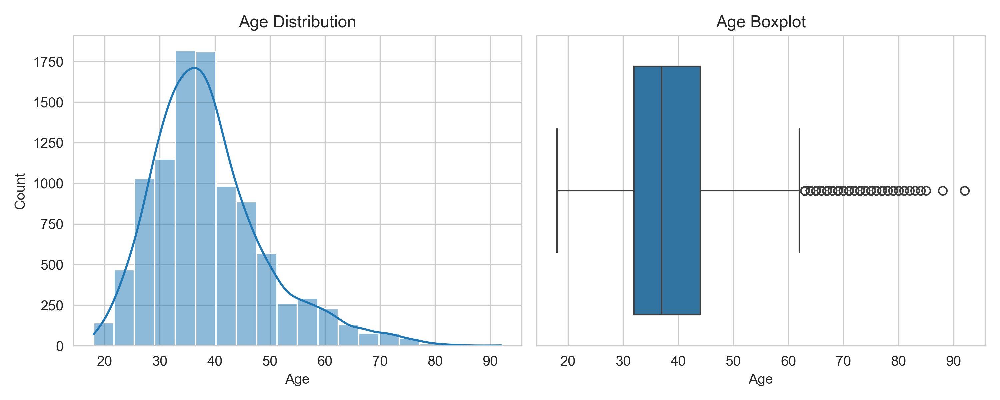
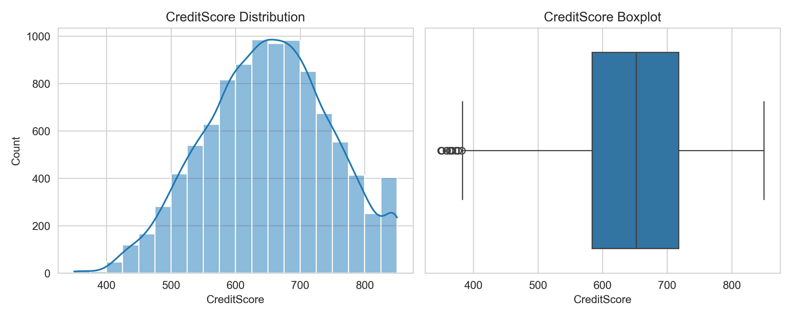

## Customer Churn Prediction

Predict which bank customers are likely to leave and understand the key factors driving churn.

### Project Overview

Customer churn is a major challenge in the banking sector, as retaining existing customers is more cost-effective than acquiring new ones.
This project focuses on building machine learning models to predict whether a customer will churn based on demographic and account-related features. The goal is to help businesses identify high-risk customers and take proactive retention actions.

### Dataset Overview

**Records**: ~10,000 customers

**Features**: 18 (demographics, account details, customer activity)

**Target Variable**: Exited

1 → Customer churned

0 → Customer retained

**Key Features**:

Age, CreditScore, Balance

NumOfProducts, IsActiveMember, EstimatedSalary

Geography, Gender, Tenure

HasCrCard, Complain

### **Libraries** **used**:
1. Python 
2. Pandas
3. NumPy
4. Scikit-learn
5. Matplotlib / Seaborn
6. Joblib

### **Exploratory Data Analysis (EDA)**

Performed exploratory analysis to understand customer behavior and identify churn patterns.

**EDA plots**
### Target Variable Distribution
* Churn rate: 20%

* Dataset is imbalanced → we will use F1 score  instead of accuracy.

Overall churn rate was ~20%, handled using stratified sampling and proper evaluation metrics.

### Numerical Feature Analysis
* Balance & Points Earned: Right-skewed

* Age: Moderate skew; churn higher in 39–51

* Credit Score & Tenure: Symmetric

* Balance insight: Median balance higher for churned (~$110k) than retained (~$90k)

* Salary & Points: Little impact on churn
#### Age

Customers aged 39–51 and those with balance around $110k showed higher churn.

#### Credit Score

### Categorical / Binary Features
#### Geography vs Churn

#### Gender vs Churn

* Geography: France (16%) & Germany (32%) churn more than Spain (17%)

* Gender: Females churn more (25%) than males (16%)

* Card Type: Diamond holders churn highest (22%),Gold 19%, Platinum 20%, Silver 20%

**Feature Engineering (Binned Features)**

AgeGroup: Highest churn in 45–54 (~51%)

CreditScoreGroup & SalaryGroup: Minor impact

**Correlation Heatmap**

Age & Balance: Weak positive correlation with churn

Complain: Perfect correlation → removed

**Key Takeaways**

* Middle-aged customers (39–54) are most likely to churn.

* Geography, gender, and card type affect churn.

* Credit score and salary have little influence.

* Target imbalance → use F1 score / ROC metrics.

### **Data Preprocessing & Feature Engineering**

1. Removed irrelevant columns (RowNumber, CustomerId, Surname)

2. Applied one-hot encoding for categorical variables

3. Scaled numerical features using StandardScaler

4. Used stratified train-test split to handle class imbalance

No missing values were found, and duplicates were removed.

### Machine Learning Pipeline

The project uses an end-to-end ML pipeline to streamline data preprocessing, model training, and evaluation. This ensures reproducibility and allows easy experimentation with multiple models.

**Pipeline Steps**:

Data Loading

Data Cleaning

Feature Encoding & One-Hot Encoding for categorical variables

Train-Test Split (Stratified)

Feature Scaling (StandardScaler)

Model Training

Model Evaluation (Accuracy, Precision, Recall, F1-score)

Model Saving

Model Deployment (Flask API for real-time predictions)

Using a pipeline helps maintain consistency across all models and reduces manual preprocessing errors, making the workflow robust and scalable

### Model training

Trained and compared multiple machine learning models:
1. Random Forest
2. K-Nearest Neighbors (KNN)
3. Support Vector Machine (SVM)
4. Gradient Boosting Classifier

### Hyperparameter Tuning
- Initial models used manually selected hyperparameters.  
- For SVM:
  - `C = 0.5`, `kernel = 'rbf'`, `gamma = 'scale'`, `class_weight = 'balanced'`  
  - Chosen to balance recall and precision for churn prediction.  
- Future improvements include automated tuning using GridSearchCV or RandomizedSearchCV to optimize performance.

### Model Evaluation Results

After training multiple machine learning models for customer churn prediction, the following performance metrics were obtained:

### Evaluation Metrics
- **Accuracy:** Overall correctness of predictions.  
- **Precision:** Fraction of predicted churn customers who actually churned.  
- **Recall:** Fraction of actual churn customers correctly identified. *(Critical for business use-case)*  
- **F1-Score:** Harmonic mean of precision and recall, used to evaluate imbalanced datasets.

#### Random Forest
Accuracy: 0.87
Precision: 0.80
Recall: 0.49
F1 Score: 0.60
ROC AUC Score:0.72

#### Insight: 
High accuracy and precision, but fails to capture a large portion of churn customers (low recall).

#### K-Nearest Neighbors (KNN)
Accuracy: 0.81
Precision: 0.56
Recall: 0.36
F1 Score: 0.44
ROC AUC Score:0.64
 
#### Insight: Overall weaker performance compared to other models.

#### Support Vector Machine (SVM)
Accuracy: 0.78
Precision: 0.48
Recall: 0.75
F1 Score: 0.59
ROC AUC Score:0.77

#### Insight: 
This model captures 75% of churners, which is crucial for retention. ROC-AUC of 0.77 shows good separation between churn and non-churn customers.
#### Gradient Boosting
Accuracy: 0.86
Precision: 0.74
Recall: 0.50
F1 Score: 0.60
ROC AUC Score:0.72

#### Insight: 
Provides a good balance between precision and recall.

##### Best Model Selection

The Support Vector Machine (SVM) was chosen as the best model because it has the highest recall (0.75).

**Why recall matters**:

* In churn prediction, it’s more important to catch customers who are likely to leave than to avoid false alarms.
* Missing a churner can lead to lost revenue, so identifying potential churners is the priority.

#### Trade-off:

* SVM captures more churners (high recall)
* Some non-churners may be incorrectly flagged (lower precision)
* This trade-off is acceptable for customer retention.

#### Conclusion:

* Recall improved to ~75% with SVM
* The model is ready for deployment to identify at-risk customers
* Further improvements are possible with threshold tuning, SMOTE, or advanced boosting methods
### Business Impact
The model helps identify customers at high risk of churn, enabling businesses to take targeted actions such as personalized offers or improved support, ultimately reducing customer loss.

### Project Structure
customer-churn/
│
├── data/
├── notebooks/
├── models/
├── src/
│   ├── preprocessing.py
│   ├── model_training.py
│   ├── model_evaluation.py
│
├── main.py
├── requirements.txt
└── README.md

**How to Run**

1. git clone <repo-link>

2. cd customer-churn

3. pip install -r requirements.txt

4. python main.py
5. How to Use Flask API
Run the API:
in terminal:
python app.py
5. python app.py
6. curl command

#### Model Saving

The best-performing model is saved as a .pkl file using Joblib for future use or deployment.

**Future Improvements**

1. Hyperparameter tuning (GridSearchCV)

2. Cross-validation

3. Model explainability (SHAP)

4. Handling class imbalance using SMOTE

5. ROC curve visualization

### Key Learnings

1. Built an end-to-end machine learning pipeline

2. Applied data preprocessing and feature engineering techniques

3. Compared multiple models and selected the best performer

4. Evaluated models using business-relevant metrics

5. Improved model reliability using stratified sampling

6. Deployed using FlaskAPI to predict real-time customer churn.

Author

Niharika Bisoyi
Aspiring Data Scientist | Machine Learning Enthusiast

